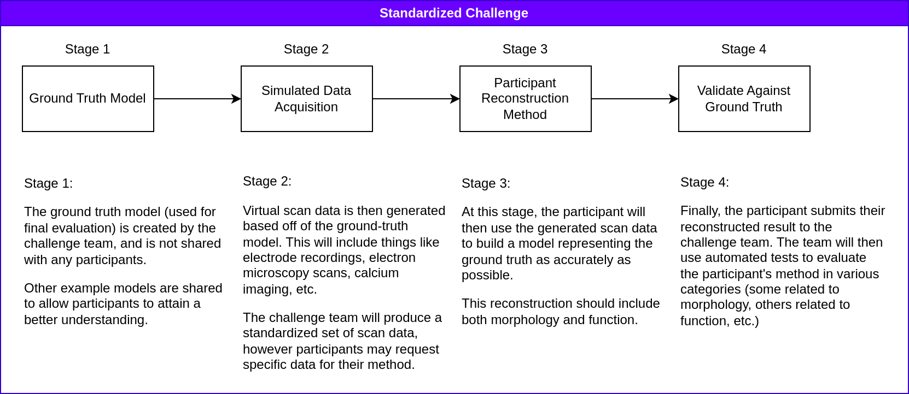
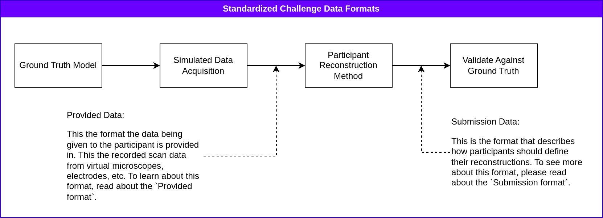

# Standardized Format For Challenge Submissions

This document describes the format for which data is generated from the Standardized Challenge and sent to participants. Additionally, it describes the format expected of submissions.

To see an overview of the challenge, please reference the below image:




To understand the two types of formats that are being defined here, and to see what they do, please reference the following image:



# Provided Data

- Root Directory

    - `Index.json` (file)
        
        ```json
            {
                'TotalElectrodes': <int>,
                'TotalEMRegions': <int>,
                'TotalCARegions': <int>
            }
        ```

    - `Electrodes` (dir)
        
        Contains one file per electrode, the total number of files will be equal to the TotalElectrodes parameter in Index.json.
        Files start at `0`, and count upwards sequentially.
        The format is as follows: `%i.json` where `%i` is an integer.

        - `0.json` Example Format:

        ```json
            {
                'Name': <string>,
                'TipPosition': [XPos_um, YPos_um, ZPos_um],
                'EndPosition': [XPos_um, YPos_um, ZPos_um],
                'Sites': [
                    [XRatio, YRatio, ZRatio],
                    ...
                ],
                'TimeStamp_ms': [0,....,999,1999,...,2299]
                'ElectricField_mV': [
                    [...site 0 electric field potential in mV...]
                    [...site 1...]
                    ...
                ]
            }
        ```

        At time points where recordings are made, the electric field potential
        is recorded at all of the sites of that electrode.
        TipPosition and EndPosition are specified in world coordinates.
        The XRatio, YRatio and ZRatio of each electrode site specify where a
        site is located on the eletrode as a ratio of its X, Y and Z dimensions.
        For example, a site located at ZRatio=0.5 in the middle of the electrode
        along its Z-axis.


    - `EMRegions` (dir)

        This directory will have `TotalEMRegions` subdirectories, also named in sequential integers starting from 0.
        Each one will represent a specific region. 
        Please see the below example of one region.

        - `0` Example Dir:

            - `Params.json` Example file: 
            ```json
                {
                    'NumImagesX': <int>,
                    'NumImagesY': <int>,
                    'NumSlices': <int>,
                    'SliceThickness_um': <float>,
                    'ScanRegionBottomLeft_um': [X_um, Y_um, Z_um],
                    'ScanRegionTopRight_um': [X_um, Y_um, Z_um],
                    'SampleRotation_rad': [X_rad, Y_rad, Z_rad],
                    'Overlap_percent': <float>
                }
            ```

            - `Data` Directory:

                This directory contains the image files.
                There will be many subdirectories containing each slice, and these will have the images for each slice within.
                Please see the example Provided Dataset for more info.

    - `CARegions` (dir)

        This directory will have `TotalCARegions` subdirectories, also named in sequential integers starting from 0.
        Each one will represent a specific region. 
        Please see the below example of one region.

        - `0` Example Dir:

            - `Params.json` Example file: 
            ```json
                {
                    'SheetThickness_um': <float>,
                    'ScanRegionBottomLeft_um': [X_um, Y_um, Z_um],
                    'ScanRegionTopRight_um': [X_um, Y_um, Z_um],
                    'SampleRotation_rad': [X_rad, Y_rad, Z_rad],
                    'IndicatorName': <string>,
                    'ImageTimestep_ms': <float>
                }
            ```

            - `Data` Directory:

                This directory contains the image files.
                There will be many subdirectories containing each slice, and these will have the images for each slice within.
                Please see the example Provided Dataset for more info.
