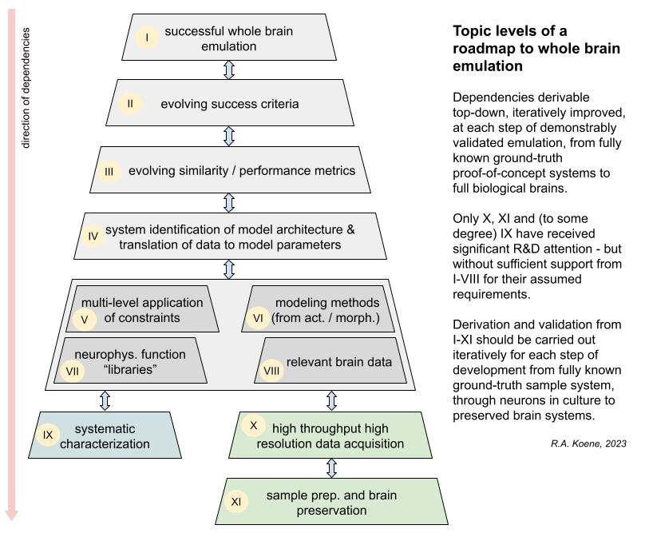

# Ball-and-stick neurons - Example VBP specification

The ball-and-stick example is intended to provide the simplest in-silico case with the smallest
number of variables to address while still demonstrating the full process and dependencies
chain for whole brain emulation.

It is an E0 level example, because there are only 2 "neurons" involved.

  
**Fig.1.** A pyramid of dependencies from the goals of successful whole brain emulation to brain
specific data.

For the sake of completeness, and because it is the first proof-of-concept level, this example
goes to extra lengths to be explicit about every topic-level and every step of the in-silico
example process. The model files are labeled using the following template:

```
<example-name>_<VBP-process-step>_<process-label>_<topic-level>_<topic-label>.py
```

Where:

`<example-name>` is the common name that identifies all files belonging to this example,
here using the abbreviation "bs" for "ball-and-stick".

`<VBP-process-step>` is an enumeration of the in-silico process step, "vbp00", "vbp01",
etc. This ensures that files are shown in process order when listed.

`<process-label>` is the corresponding label of the process step, "groundtruth",
"acquisition", "translation", "emulation".

`<topic-level>` is one of the IDs from I to XI, as showin the diagram in Fig.1 above.

`<topic-label>` is the corresponding label of the topic level, as shown in the diagram
in Fig.1 above, such as "sampleprep", "systemidentification", "successcriteria".

## Overview

1. Specify a known ground-truth (KGT) model.
2. Specify double-blind data acquisition from the KGT.
3. Specify a system identification process using the data.
4. Specify a validation procedure for the resulting emulation.

---
Randal A. Koene, 20230621
