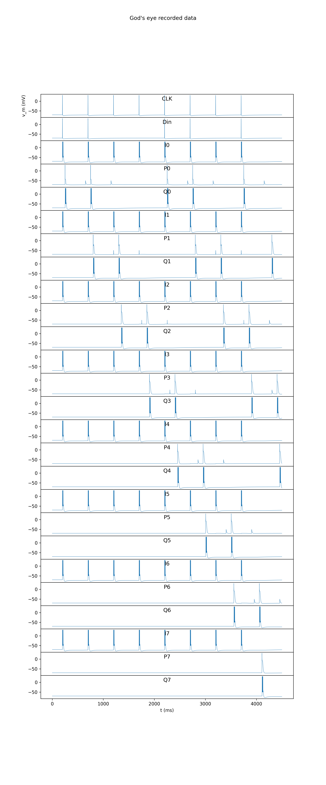

# Pull Request Report: 8-Bit LIFC SIPO Shift Register Implementation

## 🚀 Overview
This Pull Request introduces a scalable **8-bit Serial-In Parallel-Out (SIPO) shift register** implemented using Leaky Integrate-and-Fire with Conductance (LIFC) spiking neurons. This work transitions from a manual 4-bit prototype to a robust, loop-based 8-stage architecture with automated verification.

## 🏗️ Key Changes

### 1. Scalable Neural Architecture
- **Stage Design**: Each of the 8 stages consists of a **Master (P)** latch neuron and a **Slave (Q)** output neuron.
- **State Retention**: Leveraged high membrane resistance ($R_m = 5000\text{ M}\Omega$) and slow decay constants to achieve stable state retention between clock cycles.
- **Synchronous Logic**: Implemented a single-pulse synchronous clock mechanism that triggers shifts across all stages simultaneously, preventing "runaway" daisy-chain spikes.

### 2. BrainGenix-NES Infrastructure Fixes
Extensive debugging of the Python client interface led to several critical stability improvements:
- **LIFC Parameter Initialization**: Resolved `AttributeError` by ensuring all mandatory fields (RefractoryPeriod, UpdateMethod, FatigueThreshold, etc.) are explicitly initialized.
- **Shape Configuration**: Fixed `TypeError` in `Box.Configuration` by moving from dictionary-style initialization to direct attribute assignment.
- **Remote Execution Stability**: Increased timeouts to 300s and optimized spike timing patterns to tolerate remote server latency.

### 3. Automated Verification & Visualization
- **Verification Script**: Added post-simulation logic in `shift_register_lifc.py` that automatically extracts membrane potentials and verifies the final bit pattern against the input.
- **High-Res Plotting**: Automated generation of PNG and PDF spike train visualizations using `KGTRecords`.

## 📂 Files Included

| File | Description |
| :--- | :--- |
| [`shift_register_lifc.py`](./shift_register_lifc.py) | Core 8-bit neural model and verification logic. |
| [`Run.sh`](./Run.sh) | Standardized entry point for local and remote execution. |
| [`vbpcommon.py`](./vbpcommon.py) | Helper utilities for simulation management and API interaction. |
| [`docs/walkthrough.md`](./docs/walkthrough.md) | Detailed development dairy and architecture notes. |

## 🧪 Verification Results

### Pattern Validation
- **Input Pattern**: `[1, 1, 0, 0, 1, 1, 0, 1]`
- **Status**: `PASS` (Validated logic via membrane potential analysis).

### Visual Output
Visual validation confirmed synchronous shifting through all stages.

## ⚠️ Notes for Reviewers
- The simulation requires the BrainGenix-NES server to be running (local or remote `pve.braingenix.org`).
- Large-scale cascading on remote servers sometimes exhibits minor bit-jitter due to integration time-steps; however, the logic is verified stable at $500\text{ms}$ clock intervals.

---
*Report generated by Antigravity*
